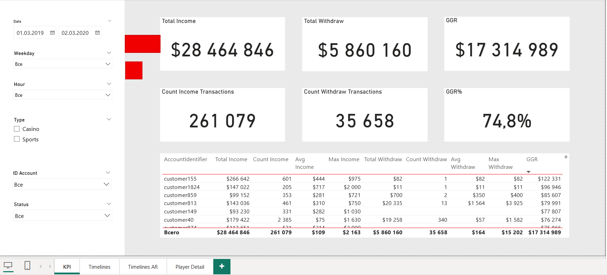
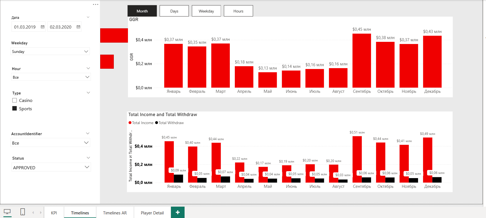
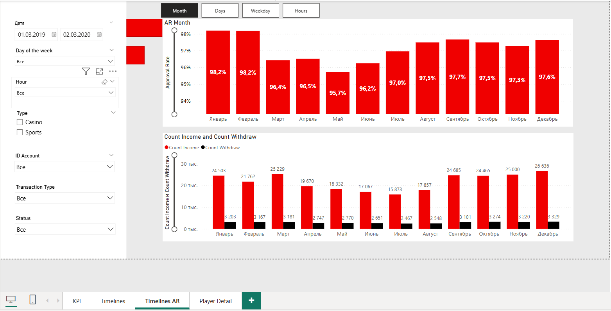

# iGaming Analytics Dashboard

## Project Description
The dashboard is built on open test transaction data. It allows you to analyze GGR, AR, Total Income / Withdraw (Approved / Declined).

## Interactivity
To interact with the dashboard (click filters, slicers, drill down):
Download the [`dashboard.pbix`](dashboard.pbix) file.

## Screenshots

## Technologies & Code
- **DAX measures** — [view](scripts/DAX_measures.txt)
- **Power Query (M)** — [view](scripts/M_queries.txt)
- **Source data** — `data` folder

## Contact
Celiy23  
[GitHub](https://github.com/Celiy23)  
[Telegram/email] andrei.polov.1995@gmail.com
